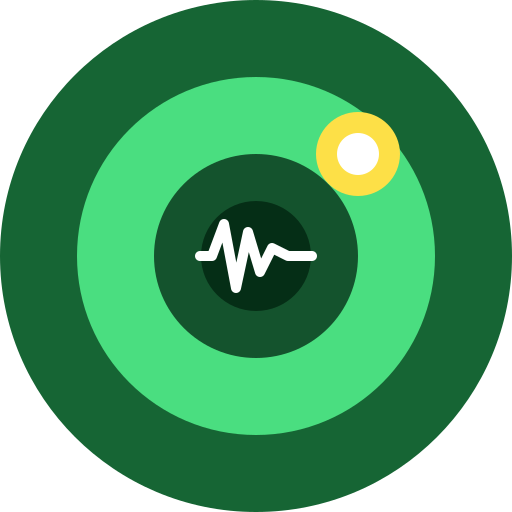
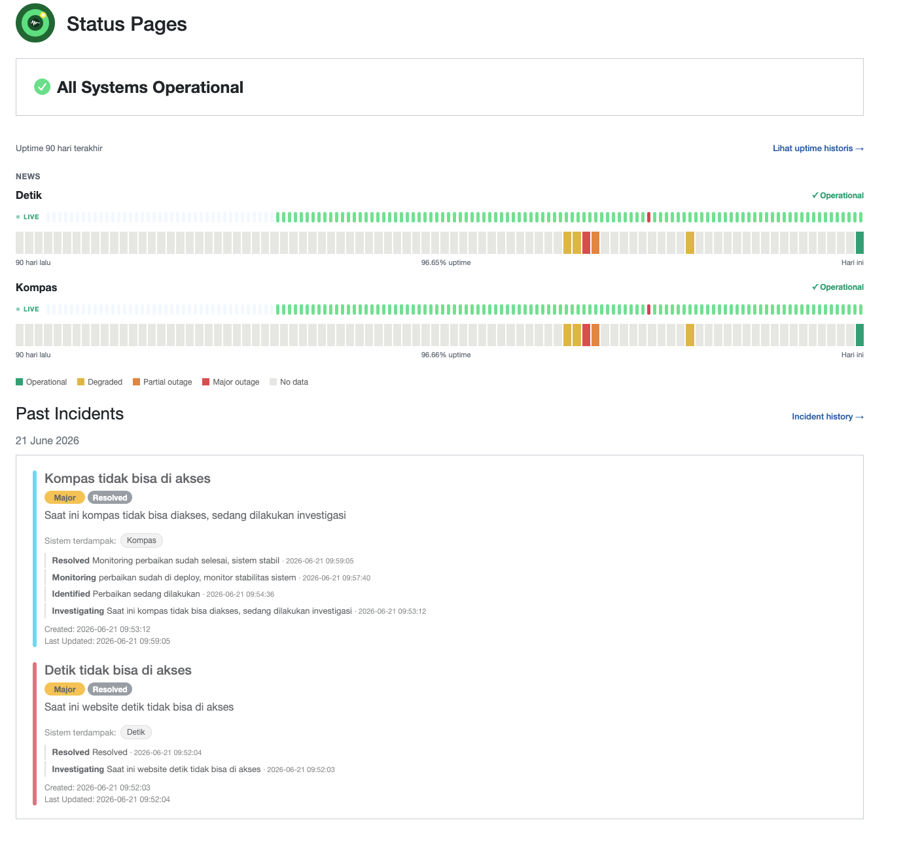

<div align="center" width="100%">
    
</div>

# Soca

**Soca** is a self-hosted **status page & uptime monitoring** tool — a customized fork of
[**Uptime Kuma**](https://github.com/louislam/uptime-kuma) (based on `v2.4.0`) with an
Atlassian-style status page and an incident-management workflow layered on top.

> 🍴 **Fork of [louislam/uptime-kuma](https://github.com/louislam/uptime-kuma)** · MIT licensed
> (see [LICENSE](./LICENSE)). All credit for the underlying monitoring engine goes to the
> original Uptime Kuma project and its contributors. Soca only adds the status-page and
> incident features described below.

## 📸 Screenshot

Public status page:

<div align="center" width="100%">
    
</div>

---

## ✨ What Soca adds on top of Uptime Kuma

A richer, Atlassian-Statuspage-style public page and incident management:

- **Incident lifecycle** — `Investigating → Identified → Monitoring → Resolved`, with **impact** levels (None / Minor / Major / Critical).
- **Incident update timeline** — post lifecycle updates; each is recorded with status, message and time.
- **Affected systems** — link an incident to specific monitors; shown as chips and used to relate incidents to the right component.
- **90-day uptime bar** (Atlassian-style) per monitor, with a **live heartbeat pulse** and a rich, light hover tooltip (status, response time, checks, daily note, related incidents).
- **Per-monitor daily notes** — annotate any day; shown in the tooltip and the calendar.
- **Maintenance** shown prominently above the monitor list.
- **Colored incident header / light body** for readable incident cards.
- **Dedicated History & Uptime pages** (`/status/:slug/history`, `/status/:slug/uptime`) with month navigation and a monthly calendar grid.
- Rebranded UI / logo to **Soca**.

> Full details with source-file pointers: **[FEATURES.md](./FEATURES.md)**.

All additions ship as **knex migrations**, so the DB schema auto-migrates on first start
(works on both **SQLite** and **MariaDB**) — no manual SQL required.

## 🧩 Inherited from Uptime Kuma

- Monitoring for HTTP(s) / TCP / Keyword / JSON-query / Ping / DNS / Push / Steam / Docker, and more.
- 90+ notification channels (Telegram, Discord, Slack, Email/SMTP, webhook, …).
- Multiple status pages, custom domains, themes, status badge, RSS.
- Scheduled maintenance, 2FA, multi-language, proxy support, certificate-expiry checks.

## 🔧 Requirements

- **Node.js ≥ 20.4.0**
- Database: **SQLite** (default, zero-config) or **MariaDB**

## 🚀 Quick start

```bash
git clone https://github.com/lumbans/soca.git
cd soca
npm ci
npm run build
node server/server.js --port=3001 --data-dir=./data
```

Open `http://localhost:3001` → first-run setup (choose SQLite, create the admin account).

### Docker

```bash
DOCKER_BUILDKIT=1 docker build -t soca .
docker run -d --name soca -p 3001:3001 -v soca-data:/app/data --restart unless-stopped soca
```

For production (rsync + systemd, shipping the Docker image, HTTPS via nginx, and
**preserving existing data on upgrade**) see **[deploy/README.md](./deploy/README.md)**.

## 🔐 Access control

Soca keeps Uptime Kuma's single-admin model: only the logged-in admin can create and manage
monitors and incidents; the public status page is read-only. Enable **2FA** in Settings.

## 🙏 Credits

Built on top of [**Uptime Kuma**](https://github.com/louislam/uptime-kuma) by
[Louis Lam](https://github.com/louislam) and its contributors.

## 📄 License

[MIT](./LICENSE) — same license as Uptime Kuma.
